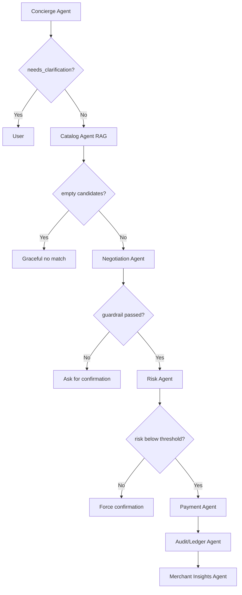

# GLASSBOX Multi-Agent System — Architecture

### LLM runtime: Groq (all LLM-driven agents call Groq's OpenAI-compatible `/openai/v1/chat/completions` endpoint)

---

## 1. Shared State

```python
class TransactionState(TypedDict):
    tenant_id: str
    session_id: str
    user_message: str                 # raw buyer input
    intent: dict                      # {category, budget_max, size, deadline, ...}
    catalog_candidates: list[dict]     # ranked products with scores + reasons
    chosen_product: dict | None
    guardrail_ceiling: float           # hard, code-set, never LLM-set
    guardrail_passed: bool
    risk_score: float | None
    risk_features: dict | None
    payment_attempts: list[dict]       # each attempt: status, reason, timestamp
    payment_status: Literal["pending","success","failed","escalated"]
    escalation_message: str | None
    audit_log: list[dict]              # every agent writes an event here, always
    current_agent: str                 # drives the live "agent status rail" in the UI
```

---

## 2. Agents Overview

| Agent | Model | Role | Decides |
|---|---|---|---|
| **Concierge** | `llama-3.3-70b-versatile` | Turn messy natural language into structured intent. | Structured intent |
| **Catalog (RAG)** | `llama-3.1-8b-instant` | Retrieve and rank real candidate products. | Ranking/justification |
| **Negotiation** | `llama-3.3-70b-versatile` | Chooses final product & enforces spend ceiling via code. | Chosen product |
| **Risk** | ML Model (XGBoost) | Score transaction for fraud/return risk. | Risk score |
| **Payment** | `llama-3.1-8b-instant` | Talk to Razorpay APIs; formats escalation messages. | — |
| **Audit/Ledger** | `llama-3.3-70b-versatile` | Summarizes events for human-readable audit logs. | — |
| **Merchant Insights** | `llama-3.1-8b-instant` | Summarizes aggregated audit logs for merchants (async). | Phrasing of real stats |

---

## 3. The LangGraph Wiring



## 4. Key Implementation Rules
- **Guardrails**: Hard checks (like `guardrail_ceiling` and retry limits) are ALWAYS enforced by deterministic code, never by the LLM. 
- **Audit**: Every state mutation triggers an append-only event in the `audit_log`.
- **Failure Handling**: Failures map to specific, graceful escalation paths rather than crashing or looping indefinitely.
