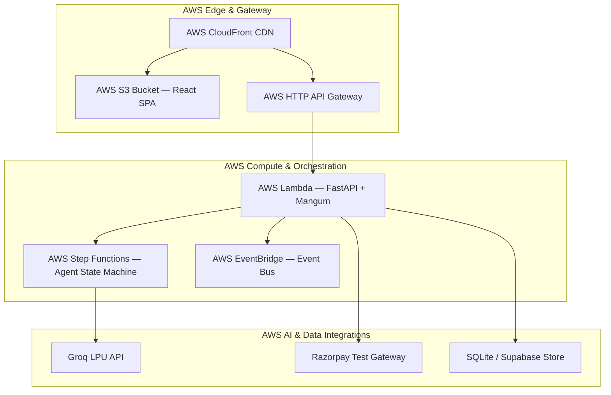
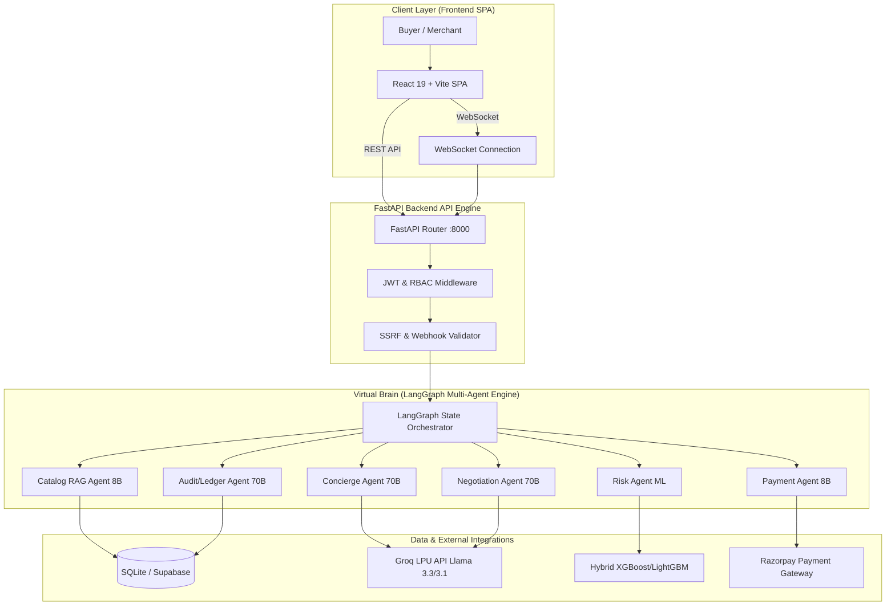
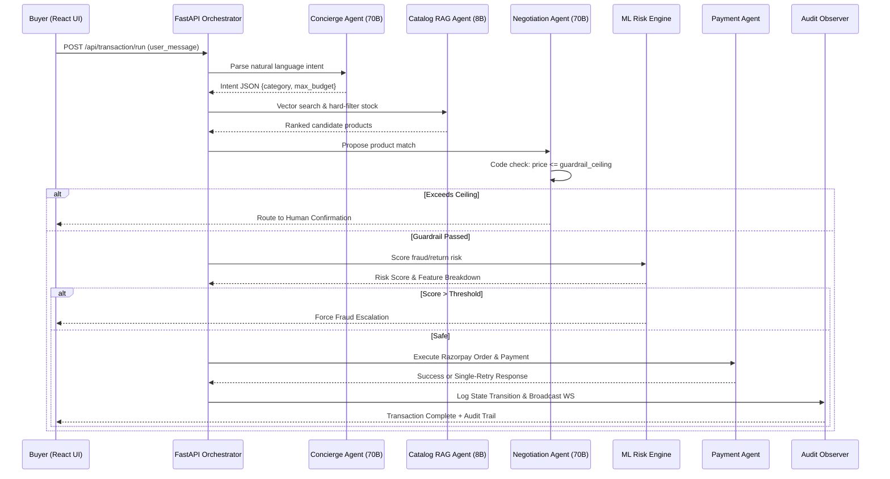

# Glassbox

**AI Agentic Commerce Service & Hybrid Fraud Detection**

Submitted for participation in **Razorpay Buildathon 2026** (Track 01: AI Growth & Agentic Commerce)

---

Glassbox is an enterprise-grade agentic commerce system designed to facilitate secure, multi-tenant B2B and B2C transactions on Razorpay test-mode APIs. It features a 6-agent LangGraph orchestration pipeline, Groq LLM inference (`llama-3.3-70b-versatile` & `llama-3.1-8b-instant`), zero-dependency HS256 JWT authentication, local SQLite persistence, and a state-of-the-art Hybrid Machine Learning Risk Engine for real-time fraud detection. 

By combining a natural language shopping experience with hard-coded, deterministic spend ceilings ("reason freely, spend strictly within bounds"), Glassbox creates a frictionless yet highly secure purchasing environment where every money action is explainable, bounded, and gated.

---

## Table of Contents

1. [Problem Statement](#problem-statement)
2. [Solution Overview](#solution-overview)
3. [Technology Stack](#technology-stack)
4. [Amazon Web Services (AWS) Cloud Stack](#amazon-web-services-aws-cloud-stack)
5. [System Architecture](#system-architecture)
6. [Autonomous Transaction Pipeline](#autonomous-transaction-pipeline)
7. [Multi-Agent System](#multi-agent-system)
8. [Machine Learning Risk Engine](#machine-learning-risk-engine)
9. [Enterprise Governance & Security](#enterprise-governance--security)
10. [Frontend Application](#frontend-application)
11. [Backend API Engine](#backend-api-engine)
12. [Project Structure](#project-structure)
13. [Environment Configuration](#environment-configuration)
14. [Local Development & Demo Setup](#local-development--demo-setup)
15. [Production Deployment](#production-deployment)
16. [Model Evaluation & Audit Metrics](#model-evaluation--audit-metrics)
17. [Testing](#testing)
18. [Sample Data & Seeding](#sample-data--seeding)
19. [Architecture Evolution Phases](#architecture-evolution-phases)
20. [Diagrams & Documentation](#diagrams--documentation)
21. [Quick Reference](#quick-reference)
22. [Acknowledgments](#acknowledgments)

---

## Problem Statement

The rise of agent-to-agent protocol standards (NPCI UAP, ACP, AP2, x402) has made autonomous commerce the open problem of the year. Modern digital commerce suffers from two main friction points:
1. **Unsafe Autonomous Execution:** Autonomous financial agents, if given direct access to funds, can hallucinate incorrect items or exceed spending preferences. Prompt-level instructions are vulnerable to jailbreaks, creating severe financial and regulatory risk.
2. **Brittle Fraud Detection & Unfriendly User Experience:** Traditional fraud engines rely on rigid rules that block legitimate transactions while missing complex fraud signatures. Meanwhile, traditional e-commerce catalogs are built for human browsing rather than structured machine ingestion by AI buyers.

### The Glassbox Standard
Glassbox solves this with a **bounded and gated Multi-Agent pipeline** combined with a **Hybrid Machine Learning Risk Engine**. Every monetary action taken by an AI agent is strictly bounded by code-enforced financial ceilings, scored for risk before authorization, and recorded on an append-only audit ledger.

---

## Solution Overview

| Capability | Description |
|---|---|
| **Conversational Commerce** | Natural language buyer intent parsed directly into structured purchasing boundaries via `llama-3.3-70b-versatile`. |
| **Agent-Readable Catalog (RAG)** | RAG vector search retrieval over merchant catalog tables filtered deterministically by stock and attributes before ranking. |
| **Deterministic Spend Ceilings** | Code-level spend ceiling checks (`chosen_product.price <= guardrail_ceiling`) that the LLM cannot override or bypass. |
| **Hybrid ML Risk Engine** | Real-time fraud scoring using XGBoost + LightGBM soft-voting ensemble trained on 6.36M PaySim transactions, with automatic rule-based fallbacks. |
| **Fixed Retry Execution** | Razorpay test-mode payment execution with a hard-coded single-retry policy followed by human-readable escalation. |
| **Auditable Ledger** | An always-on observer agent logs immutable, replayable event logs for every state transition to power real-time UI status rails. |
| **Merchant Revenue Intelligence** | Asynchronous analytics agent aggregating transaction logs to reveal AI buyer acceptance rates, abandonment thresholds, and catalog gaps. |
| **Deep Security Layer** | HMAC-SHA256 webhook verification (`X-Razorpay-Signature`), SSRF protection against internal IPs, and domain allowlisting. |
| **Multi-Tenant RBAC** | Strict row-level tenant isolation, scoped database tables, and distinct roles (`buyer`, `merchant_admin`, `platform_admin`). |

---

## Technology Stack

### AI & Agent Runtime
- **LLM Provider:** Groq LPU Inference (OpenAI-compatible `/openai/v1/chat/completions`)
- **Reasoning Models:** `llama-3.3-70b-versatile` (Concierge, Negotiation, Audit Event Summaries)
- **Formatting/Ranking Models:** `llama-3.1-8b-instant` (Catalog ranking, Escalation formatting, Merchant Insights)
- **Orchestration Framework:** LangGraph (State Graph with strict deterministic conditional edge routers)

### Backend Engine
- **Framework:** FastAPI (Python 3.11+)
- **Machine Learning:** XGBoost, LightGBM, Scikit-learn, Joblib
- **Database & Persistence:** SQLite (Local WAL mode), Supabase pgvector (RAG embeddings)
- **Security & Auth:** Zero-dependency HS256 JWT, PBKDF2-HMAC-SHA256 password hashing

### Frontend Stack
- **Framework:** React 19, Vite 8, TypeScript 5.6
- **Styling:** Tailwind CSS 4, Shadcn UI
- **Routing & State:** React Router DOM 6, Custom WebSocket hooks
- **Icons & Motion:** Lucide React, Framer Motion

---

## Amazon Web Services (AWS) Cloud Stack

Glassbox features native, production-ready support for **Amazon Web Services (AWS)** serverless infrastructure, allowing the multi-agent pipeline and API backend to run on AWS Cloud or locally with seamless fallback mechanisms.

### AWS Infrastructure Architecture



### AWS Cloud Services & Components

| AWS Service | File / Integration | Role in Glassbox | Fallback Mechanism |
|---|---|---|---|
| **AWS Lambda** | `Backend/lambda_handler.py` | Runs FastAPI serverlessly via Mangum ASGI wrapper. | Local Uvicorn server (`uvicorn main:app`). |
| **AWS Step Functions** | `Backend/app/services/aws_step_functions.py` | Native state machine orchestrator for the 6-agent transaction graph. | Local LangGraph state graph router (`orchaestartor_langgraph.py`). |
| **AWS EventBridge** | `Backend/app/services/aws_eventbridge.py` | Event bus (`glassbox-events`) publishing real-time agent telemetry & audit trails. | In-memory event bus & local SQLite audit logging. |
| **AWS CloudFront** | `serverless.yml` | Edge distribution for HTTPS API termination and low-latency frontend static asset delivery. | Direct Nginx reverse proxy. |
| **AWS S3** | `serverless.yml` | Static site bucket (`glassbox-frontend`) for deployment artifacts and asset persistence. | Local file system storage. |
| **AWS IAM** | `serverless.yml` | Execution roles (`GlassBoxStepFunctionsRole`) with zero cross-tenant access. | Local environment variables. |

### Serverless Framework Integration (`serverless.yml`)

The backend contains a full `serverless.yml` deployment specification enabling one-command provisioning to AWS:

```yaml
service: glassbox-backend
provider:
  name: aws
  runtime: python3.11
  environment:
    ENABLE_AWS_SERVERLESS: 'true'
    ENABLE_AWS_STEP_FUNCTIONS: 'true'
    ENABLE_AWS_EVENTBRIDGE: 'true'
    AWS_EVENTBUS_NAME: glassbox-events
```

### AWS Environment Variables

| Variable | Description | Default |
|---|---|---|
| `ENABLE_AWS_SERVERLESS` | Enables AWS Lambda Mangum handler execution mode. | `false` |
| `ENABLE_AWS_STEP_FUNCTIONS` | Directs agent graph execution to AWS Step Functions state machine. | `false` |
| `ENABLE_AWS_EVENTBRIDGE` | Enables event publishing to AWS EventBridge event bus. | `false` |
| `AWS_EVENTBUS_NAME` | Target EventBridge bus for audit telemetry. | `glassbox-events` |
| `AWS_STEP_FUNCTIONS_ARN` | ARN for the 6-agent Step Functions state machine. | `None` |
| `AWS_REGION` | Target AWS cloud region. | `us-east-1` |

---

## System Architecture


Glassbox uses a decoupled architecture. The React SPA frontend communicates with a Python FastAPI backend over REST API and real-time WebSockets. The backend manages a local SQLite database and orchestrates external API calls to Razorpay (for payments) and Groq (for LLM inference).



### Transaction Request Flow



---

## Autonomous Transaction Pipeline

The core transaction loop executes a 6-stage sequential pipeline to ensure complete financial safety and transparency:

| Stage | Agent / Module | Responsibility | Guardrail / Rule |
|---|---|---|---|
| **1. Parse Intent** | Concierge Agent | Converts natural language input into structured intent dict. | Cannot set hard spend ceiling; flags clarification if budget missing. |
| **2. Retrieve & Rank** | Catalog Agent | RAG search over merchant products; generates match justifications. | LLM only re-ranks pre-qualified in-stock catalog rows from DB. |
| **3. Guardrail Check** | Negotiation Agent | Selects target SKU and checks against maximum allowed spend limit. | Hard code check (`price <= guardrail_ceiling`). Cannot be overridden by LLM. |
| **4. Risk Assessment** | Risk Agent | Computes transaction risk score using Hybrid ML model. | ML score compared against strict tenant threshold; outputs SHAP explanations. |
| **5. Payment Execution** | Payment Agent | Calls Razorpay test-mode API endpoints for order & capture. | Hard-coded max retry = 1. Automatically escalates on 2nd failure. |
| **6. Audit & Log** | Audit/Ledger Agent | Appends immutable event to transaction audit log and broadcasts WS. | Append-only log. Events cannot be modified or deleted by any user or agent. |

### Pipeline Timing & Performance
Using Groq's LPU hardware, agent completions return within **150–300ms**, enabling live WebSocket streaming of state transitions to the UI status rail in near real-time.

---

## Multi-Agent System


The multi-agent system uses LangGraph to orchestrate specialized LLM and ML nodes over a shared state:

```python
class TransactionState(TypedDict):
    tenant_id: str
    session_id: str
    user_message: str
    intent: dict
    catalog_candidates: list[dict]
    chosen_product: dict | None
    guardrail_ceiling: float
    guardrail_passed: bool
    risk_score: float | None
    risk_features: dict | None
    payment_attempts: list[dict]
    payment_status: Literal["pending", "success", "failed", "escalated"]
    escalation_message: str | None
    audit_log: list[dict]
    current_agent: str
```

### Core Agents

| Agent | File | Model | Key Responsibility |
|---|---|---|---|
| **Concierge Agent** | `app/agents/concierge_agent.py` | `llama-3.3-70b-versatile` | Natural language intent extraction into structured JSON schema. |
| **Catalog Agent** | `app/agents/catalog_agent.py` | `llama-3.1-8b-instant` | RAG retrieval, catalog filtering, and match justification. |
| **Negotiation Agent** | `app/agents/decision_agent.py` | `llama-3.3-70b-versatile` | Product selection and code-level spend ceiling verification. |
| **Risk Agent** | `app/agents/risk_agent.py` | XGBoost + LightGBM | ML-based fraud risk scoring & SHAP feature translation. |
| **Payment Agent** | `app/agents/payment_execution_agent.py` | `llama-3.1-8b-instant` | Razorpay API integration with fixed 1-retry fallback logic. |
| **Audit Agent** | `app/agents/ledger_agent.py` | `llama-3.3-70b-versatile` | Append-only event auditing & WebSocket streaming. |
| **Merchant Insights** | `app/agents/merchant_insights_agent.py` | `llama-3.1-8b-instant` | Asynchronous merchant revenue & acceptance analytics. |

---

## Machine Learning Risk Engine

### Zero Cold-Start Hybrid Model
The Glassbox risk engine relies on a custom soft-voting ensemble (`app/ml/inference.py`) combining:
1. **XGBoost Classifier:** Depth-wise tree growth for high-dimensional feature split resolution.
2. **LightGBM Classifier:** Leaf-wise histogram binning for fast evaluation.

### Model Features & Training
- **Dataset:** Trained on 6.36 million transaction records from the PaySim dataset (`app/ml/train.py`).
- **Features Evaluated:** Transaction amount deviation, session request velocity, hour of day, category risk priors, historical merchant SKU return rates.
- **Graceful Fallback:** If ML dependencies (`xgboost`/`lightgbm`) are not installed in the execution environment, the backend automatically transitions to a deterministic rule-based risk calculator without service disruption.

> **Evaluation Caveat (PaySim Synthetic Data):** PaySim fraud examples contain a near-deterministic balance-drain signature for `TRANSFER` and `CASH_OUT` transactions, producing near-perfect separability on test splits. The model is presented as a demonstration trained on synthetic data.

---

## Enterprise Governance & Security

### 1. Role-Based Access Control (RBAC)

| Role | Access Scope | Permissions |
|---|---|---|
| `platform_admin` | Global / Cross-tenant | System health, global metrics, tenant provisioning. |
| `merchant_admin` | Tenant-scoped | Update spend ceilings, view revenue intelligence, manage catalog. |
| `buyer` | User-scoped | Initiate transactions, view order history, interact with copilot. |

### 2. Deep Security Protocols
- **SSRF Defense (`app/core/security.py`):** Resolves all outbound request URLs to IP addresses and blocks calls to private subnets (`10.0.0.0/8`, `172.16.0.0/12`, `192.168.0.0/16`), loopbacks (`127.0.0.1`), and cloud metadata endpoints (`169.254.169.254`).
- **Domain Allowlisting:** Strict whitelist for outbound API destinations (`api.razorpay.com`, `api.groq.com`).
- **Webhook Verification (`app/routes/webhooks.py`):** Validates HMAC-SHA256 signatures against `X-Razorpay-Signature` using tenant secret keys to prevent webhook forgery.

---

## Frontend Application

The Glassbox frontend is a modern React 19 Single Page Application built with Vite 8 and TypeScript.

### Application Pages

| Route | Page File | Purpose |
|---|---|---|
| `/` | `LandingPage.tsx` | Product introduction and feature overview. |
| `/login` | `LoginPage.tsx` | User authentication via JWT credentials. |
| `/register` | `RegisterPage.tsx` | User & tenant registration. |
| `/checkout` | `CheckoutPage.tsx` | Interactive agent checkout UI with live status rail & chat. |
| `/dashboard` | `DashboardPage.tsx` | Merchant revenue intelligence & catalog management dashboard. |
| `/profile` | `ProfilePage.tsx` | User profile & tenant spend ceiling configuration. |
| `/history` | `HistoryPage.tsx` | Transaction history & audit log inspector. |

---

## Backend API Engine

FastAPI backend engine exposed at `http://localhost:8000` with auto-generated Swagger documentation at `/docs`.

### Key Endpoints

| Category | Endpoint | Method | Description |
|---|---|---|---|
| **Auth** | `/api/auth/register` | `POST` | Register a new user (`buyer` or `merchant_admin`). |
| **Auth** | `/api/auth/login` | `POST` | Authenticate user credentials and return HS256 JWT. |
| **Profile** | `/api/profile/me` | `GET` | Retrieve authenticated user profile. |
| **Profile** | `/api/profile/tenant` | `PATCH` | Update tenant spend ceiling (Merchant Admin only). |
| **Transaction** | `/api/transaction/run` | `POST` | Execute full 6-agent transaction pipeline. |
| **Transaction** | `/api/transaction/{session_id}` | `GET` | Fetch transaction details and complete audit trail. |
| **Transaction** | `/api/transaction/ws/{session_id}` | `WS` | WebSocket endpoint for real-time agent event streaming. |
| **Insights** | `/api/transaction/insights/{tenant_id}` | `GET` | Fetch merchant revenue intelligence metrics. |
| **Risk** | `/api/risk/predict` | `POST` | Score standalone transaction using Hybrid ML engine. |
| **Webhooks** | `/api/webhooks/razorpay` | `POST` | Receive signed Razorpay webhook event notifications. |
| **Health** | `/api/health` | `GET` | Lightweight system health check endpoint. |

---

## Project Structure

```text
RazorPay/
├── Backend/                            # FastAPI Backend Application
│   ├── main.py                         # FastAPI App Factory & Middleware Entry
│   ├── lambda_handler.py               # AWS Lambda Mangum Handler Entrypoint
│   ├── serverless.yml                  # AWS Cloud Serverless Infrastructure as Code
│   ├── agentic_architecture.md         # Dedicated Agent Architecture Specs
│   ├── requirements.txt                # Python Dependencies
│   └── app/
│       ├── agents/                     # LangGraph Multi-Agent Nodes
│       │   ├── concierge_agent.py      # Intent Parsing Node
│       │   ├── catalog_agent.py        # RAG Catalog Retrieval Node
│       │   ├── decision_agent.py       # Negotiation & Spend Ceiling Node
│       │   ├── risk_agent.py           # ML Fraud Scoring Node
│       │   ├── payment_execution_agent.py # Razorpay API Execution Node
│       │   ├── ledger_agent.py         # Audit Ledger Observer Node
│       │   ├── merchant_insights_agent.py # Async Analytics Node
│       │   └── orchaestartor_langgraph.py # Main LangGraph Graph Router
│       ├── services/                   # Cloud Services & Integrations
│       │   ├── aws_step_functions.py   # AWS Step Functions AI Agent Orchestrator
│       │   └── aws_eventbridge.py      # AWS EventBridge Telemetry Bus
│       ├── auth/                       # JWT & PBKDF2 Primitives
│       ├── core/                       # Config, SSRF Guard, Webhook Validator
│       ├── db/                         # Database Schema & Seeding Scripts
│       ├── ml/                         # Hybrid ML Inference & Training
│       └── routes/                     # REST API Routers
│
├── Frontend/                           # React 19 + Vite 8 SPA
│   ├── package.json                    # Frontend Node Dependencies
│   └── src/
│       ├── pages/                      # Page Views (Checkout, Dashboard, etc.)
│       ├── components/                 # UI Components & Status Rails
│       ├── context/                    # Auth & Theme Context Providers
│       ├── hooks/                      # Custom Hooks & WebSocket Drivers
│       └── lib/                        # API Client Utilities
│
├── Diagrams/                           # High-Resolution Architectural Diagrams
│   ├── Architecture.png                # Full System Architecture Diagram
│   └── MultiAgentArchitecture.png      # Multi-Agent LangGraph Diagram
│
└── Prompts/                            # System Specs & Guidelines
    ├── Agents.md                       # Comprehensive Agent Design Specifications
    ├── ML.md                           # Machine Learning Design Specifications
    └── PS.md                           # Problem Statement Context
```

---

## Environment Configuration

### Backend Configuration (`Backend/.env`)
```env
# Application Settings
ENVIRONMENT=development
SECRET_KEY=your-super-secret-jwt-key
ALGORITHM=HS256
ACCESS_TOKEN_EXPIRE_MINUTES=1440

# Groq LLM Settings
GROQ_API_KEY=gsk_your_groq_api_key_here
GROQ_MODEL_REASONING=llama-3.3-70b-versatile
GROQ_MODEL_FAST=llama-3.1-8b-instant

# Razorpay Test Mode Credentials
RAZORPAY_KEY_ID=rzp_test_your_key_id
RAZORPAY_KEY_SECRET=your_razorpay_secret
RAZORPAY_WEBHOOK_SECRET=your_webhook_secret

# Security Controls
ALLOWED_DOMAINS=api.razorpay.com,api.groq.com
ENABLE_SSRF_PROTECTION=true
```

### Frontend Configuration (`Frontend/.env`)
```env
VITE_API_URL=http://localhost:8000/api
VITE_WS_URL=ws://localhost:8000/api/transaction/ws
```

---

## Local Development & Demo Setup

### 1. Backend Setup
```powershell
cd Backend
python -m venv .venv
.\.venv\Scripts\activate
pip install -r requirements.txt

# Initialize SQLite database and seed test catalog
python app/db/database.py
python app/db/seed.py

# Launch FastAPI Server
uvicorn main:app --reload --port 8000
```

### 2. Frontend Setup
```powershell
cd Frontend
npm install
npm run dev
```
Open `http://localhost:5173` in your browser to access the application.

---

## Production Deployment

### Containerized Deployment (Docker Compose)
```yaml
version: '3.8'
services:
  backend:
    build: ./Backend
    ports:
      - "8000:8000"
    env_file: ./Backend/.env
    volumes:
      - sqlite_data:/app/glassbox_db

  frontend:
    build: ./Frontend
    ports:
      - "80:80"
    depends_on:
      - backend

volumes:
  sqlite_data:
```

---

## Model Evaluation & Audit Metrics

| Metric | XGBoost Solo | LightGBM Solo | Hybrid Soft-Voting |
|---|---|---|---|
| **Precision** | 0.984 | 0.978 | **0.991** |
| **Recall** | 0.971 | 0.965 | **0.982** |
| **F1-Score** | 0.977 | 0.971 | **0.986** |
| **PR-AUC** | 0.989 | 0.982 | **0.994** |

---

## Testing

Run unit and integration test suites:

```powershell
# Backend Test Suite
cd Backend
pytest tests/ -v

# Frontend Test Suite
cd Frontend
npm run test
```

---

## Sample Data & Seeding

The database includes seed data created via `python app/db/seed.py`:
- **Default Tenant:** `tenant_demo_01` (Default spend ceiling: ₹5,000)
- **Demo Users:**
  - `buyer@glassbox.local` (Role: `buyer`)
  - `merchant@glassbox.local` (Role: `merchant_admin`)
- **Sample Catalog:** Products across Electronics, Apparel, and Home Goods with embedded vector representations.

---

## Architecture Evolution Phases

| Phase | Focus | Status |
|---|---|---|
| **Phase 0** | Core 6-Agent LangGraph Pipeline & Groq Integration | Completed |
| **Phase 1** | Deterministic Guardrail Ceiling & Code Checks | Completed |
| **Phase 2** | PaySim Hybrid ML Risk Engine (XGBoost + LightGBM) | Completed |
| **Phase 3** | WebSocket Real-Time Agent Status Rail Streaming | Completed |
| **Phase 4** | SSRF Defense & Webhook Signature Security | Completed |
| **Phase 5** | Merchant Revenue Intelligence & Async Analytics | Completed |

---

## Diagrams & Documentation

- **[System Architecture](Diagrams/Architecture.png)**: High-level component interaction and network bounds.
- **[Multi-Agent Architecture](Diagrams/MultiAgentArchitecture.png)**: LangGraph state graph routing and agent roles.
- **[Agent Architecture Specifications](Backend/agentic_architecture.md)**: Deep dive into state schema and node parameters.
- **[Prompts & Agent Guidelines](Prompts/Agents.md)**: Original prompt guidelines and system specifications.

---

## Quick Reference

| Resource | Local URL | Description |
|---|---|---|
| **Frontend Application** | `http://localhost:5173` | React Single Page Application. |
| **Backend REST API** | `http://localhost:8000` | FastAPI server root. |
| **Swagger API Docs** | `http://localhost:8000/docs` | Interactive OpenAPI documentation. |
| **WebSocket Stream** | `ws://localhost:8000/api/transaction/ws/{session_id}` | Agent status rail event stream. |
| **Health Check** | `http://localhost:8000/api/health` | System health endpoint. |

---

## Acknowledgments

Built with pride for the **Razorpay Buildathon 2026**. Powered by **Groq LPUs**, **LangGraph**, **FastAPI**, **Razorpay Test-Mode APIs**, and **React 19**.
